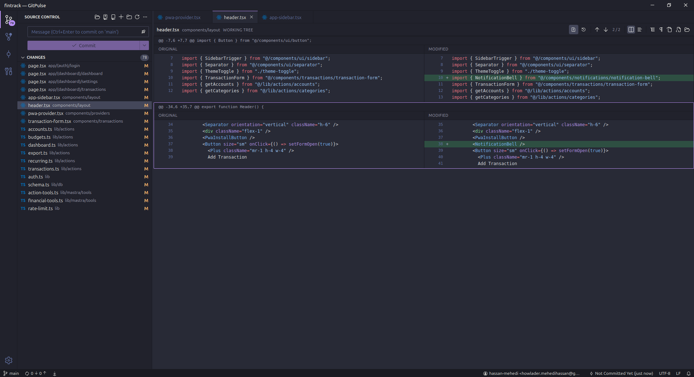
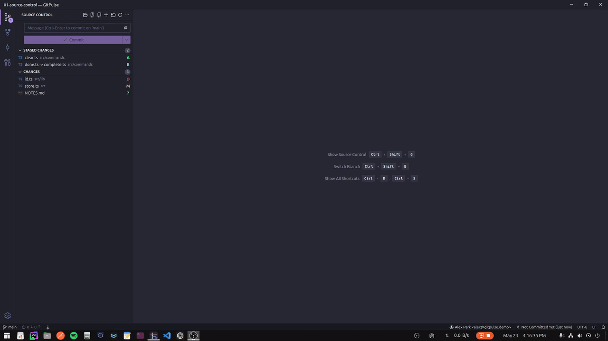
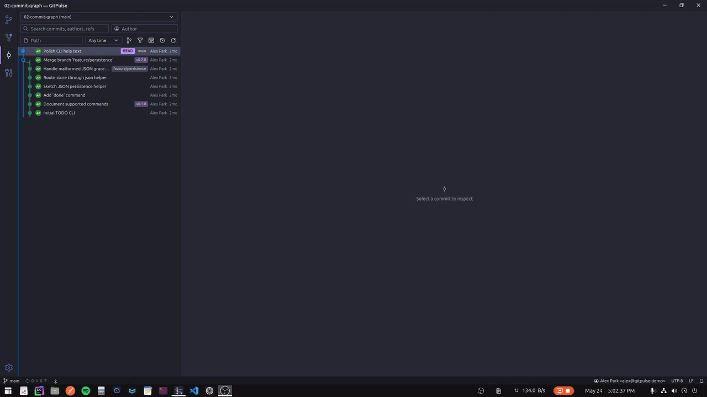
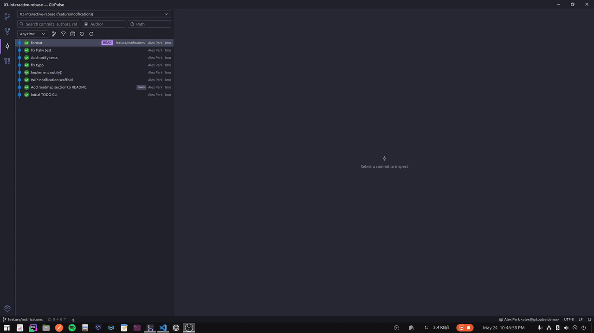
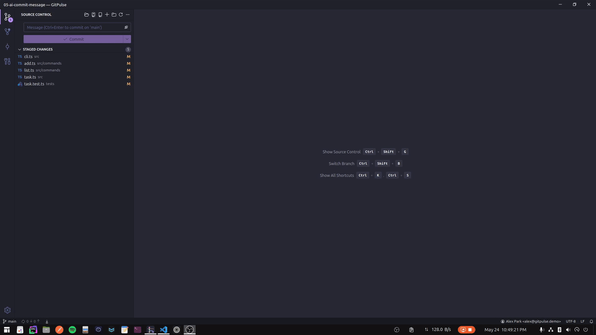

# GitPulse

A VS Code-inspired desktop Git GUI built with Tauri v2, React, and Rust.



GitPulse aims to give you a fast, native-feeling Git client with the keybindings and visual language you already know from VS Code, plus features the VS Code source-control panel doesn't include — a virtualized commit graph for huge histories, interactive rebase, blame, file history, worktrees, an inline merge editor, and optional AI-generated commit messages (including a fully local, free path via Ollama).

## Table of contents

- [Install](#install)
- [First-time setup](#first-time-setup)
- [Using GitPulse](#using-gitpulse)
- [AI commit messages](#ai-commit-messages)
- [Keyboard shortcuts](#keyboard-shortcuts)
- [Where your data lives](#where-your-data-lives)
- [Troubleshooting](#troubleshooting)
- [Building from source](#building-from-source)
- [License](#license)

## Install

All bundles are published on the [Releases page](https://github.com/hassan-mehedi/gitpulse/releases/latest).

### Linux

Pick the format that matches your distro. All three contain the same app.

| Format | Install command |
| --- | --- |
| `.deb` (Debian, Ubuntu, Pop!_OS, Mint) | `sudo apt install ./GitPulse_<version>_amd64.deb` |
| `.rpm` (Fedora, RHEL, openSUSE) | `sudo dnf install ./GitPulse-<version>-1.x86_64.rpm` |
| `.AppImage` (any distro, no install) | `chmod +x GitPulse_<version>_amd64.AppImage && ./GitPulse_<version>_amd64.AppImage` |

Runtime dependencies (the `.deb`/`.rpm` declare these; `.AppImage` needs them present on the system):

- WebKitGTK 4.1 (`libwebkit2gtk-4.1-0` on Debian/Ubuntu, `webkit2gtk4.1` on Fedora)
- GTK 3 (`libgtk-3-0` / `gtk3`)
- AyatanaAppIndicator 3 (`libayatana-appindicator3-1` / `libayatana-appindicator-gtk3`)
- `git` on `PATH`

### macOS

Download the `.dmg` matching your CPU (`GitPulse_<version>_x64.dmg` for Intel, `GitPulse_<version>_aarch64.dmg` for Apple Silicon), open it, and drag GitPulse to `Applications`.

The bundles are **not code-signed**, so on first launch macOS will refuse to open the app. Work around it once:

1. Right-click `GitPulse.app` in `Applications` → **Open**.
2. In the dialog, click **Open** again.
3. If Gatekeeper still blocks it, open **System Settings → Privacy & Security**, scroll to the message about GitPulse being blocked, and click **Open Anyway**.

After that, future launches work normally.

### Windows

Download `GitPulse_<version>_x64-setup.exe` and run it.

SmartScreen will warn that the publisher is unverified (the installer isn't signed). To proceed:

1. Click **More info** in the SmartScreen dialog.
2. Click **Run anyway**.

You'll also need Git installed and on `PATH` ([git-scm.com](https://git-scm.com/download/win)).

## First-time setup

1. **Open a repository.** Use the welcome screen's *Open Folder* button or drag a folder onto the window. You can also open multiple repos at once — they'll appear as separate sections in the source control sidebar.
2. **Set a commit identity (optional).** Go to **Settings → Commit Identities** and add one. You can configure a default identity and override it per repo. If you skip this, GitPulse uses whatever your `git config` already has.
3. **Configure AI commit messages (optional).** See [AI commit messages](#ai-commit-messages) below — there's a free local option via Ollama if you don't want to use a paid API.
4. **Set auto-fetch behaviour (optional).** **Settings → Auto Fetch** lets you choose how often GitPulse polls remotes in the background.

Open Settings any time from the gear icon in the bottom-left of the sidebar.

## Using GitPulse

### Source control



The sidebar splits changes into three buckets:

- **Merge Changes** — files with unresolved conflicts (only shown during a merge). Clicking one opens the inline merge editor; see [Resolving conflicts](#resolving-conflicts).
- **Staged Changes** — what will be committed when you hit *Commit*.
- **Changes** — modified and untracked files. Untracked directories show as a single folder row.

Hover any row for stage/unstage/discard buttons. Right-click for the full context menu (open in external editor, copy path, view history, blame, etc.).

The diff panel supports split and inline modes, whitespace toggles, word-level highlighting, binary previews, and per-hunk or per-selection stage/unstage/discard from the gutter.

### Committing

Type a message in the box at the top of the source control panel and press **Ctrl+Enter** (or click *Commit*). Some useful behaviours:

- **Empty staging area** — GitPulse offers to stage everything and commit (configurable in **Settings → Git → Stage All On Commit**).
- **Amend** — click the dropdown next to *Commit* and choose *Amend*. Pushing an amended commit that's already on a remote will prompt for force-push.
- **Undo last commit** — **Ctrl+Shift+Z** (or *Commit ▸ Undo*). The staged state is restored.
- **Sign commits** — toggle in **Settings → Git**.

### Branches

- **Ctrl+Shift+B** — branch picker (search, checkout, delete, rename).
- **Ctrl+Shift+N** — create branch from the current HEAD.
- The status bar shows the current branch, upstream, and ahead/behind counts. Clicking it opens the branch picker.
- *Publish* a branch from the branch picker to set its upstream and push for the first time.

### Commit graph



Open the **Graph** view from the activity bar (left rail). It's virtualized, so it stays smooth on repos with hundreds of thousands of commits. From a commit row you can:

- View the diff and changed files
- Cherry-pick, revert, reset (soft/mixed/hard)
- Start an interactive rebase
- Recover from the reflog
- Pick a parent when viewing merge commits

Filter by author, branch, tag, or message using the toolbar.

#### Interactive rebase



From a commit in the graph choose *Rebase ▸ Interactive*. Reorder, squash, fixup, edit, drop, or reword commits with drag-and-drop, then *Start Rebase*. GitPulse handles conflicts inline via the merge editor (see [Resolving conflicts](#resolving-conflicts)) and you can abort at any point from the rebase status banner.

### Blame and file history

Right-click any file in the source control or explorer panel → *Open Blame* or *Show File History*. Both work on the full history of the file (including across renames).

### Stash, worktrees, remotes, tags


All accessible from the activity bar. Stash supports filtering by name and message; worktrees can be created, switched, and pruned without leaving the app. The **File History** panel pairs naturally with worktrees: pick a file, scroll its commits, and the diff for that specific file renders below — drag the sash between the commit list and the diff to resize.

### Resolving conflicts


When a merge or pull leaves conflicts, the conflicted files appear in the **Merge Changes** section. Click one to open the merge editor, which shows:

- **Conflict quick fixes** — buttons to accept current, accept incoming, or accept both (in either order) for all conflicts in the file.
- A three-pane view (current / result / incoming) where you can edit and stage individual hunks.

Mark a file as resolved by staging it. Once everything is staged, the commit button changes to *Continue Merge*.

## AI commit messages



GitPulse can generate a commit message from your staged diff. Configure providers in **Settings → AI Commit Messages**.

| Provider | API key needed? | Where to get one |
| --- | --- | --- |
| **Ollama** (local, free) | No | Install [Ollama](https://ollama.com), then `ollama pull qwen2.5-coder:1.5b` (or another model) |
| OpenAI | Yes | [platform.openai.com/api-keys](https://platform.openai.com/api-keys) |
| Anthropic | Yes | [console.anthropic.com](https://console.anthropic.com/) |
| DeepSeek | Yes | [platform.deepseek.com](https://platform.deepseek.com/) |
| OpenAI-compatible | Yes | Any service that speaks the OpenAI chat-completions API (Groq, Together, OpenRouter, LM Studio, vLLM, etc.) |

### Recommended: Ollama (free, local, private)

Ollama runs an LLM on your machine — no API key, no network calls, your code stays local.

1. Install Ollama from [ollama.com](https://ollama.com).
2. Pull a small coder model:
   ```bash
   ollama pull qwen2.5-coder:1.5b   # ~1 GB, runs on any laptop
   # or, if you have 8+ GB RAM free:
   ollama pull qwen2.5-coder:7b     # noticeably better wording
   ```
3. In GitPulse → **Settings → AI Commit Messages**, select **Ollama**, leave the base URL at `http://localhost:11434`, set the model to the one you pulled, and click *Test connection*.

Once configured, the sparkle button next to the commit message box generates a draft from your staged diff. You can re-roll or edit before committing.

### Using a hosted provider

For OpenAI/Anthropic/DeepSeek/OpenAI-compatible, paste your API key into the provider's config card. The key is stored locally (see [Where your data lives](#where-your-data-lives)) and is never sent anywhere except to that provider's API. Click the eye icon next to the key field if you want to verify what you pasted.

## Keyboard shortcuts

| Shortcut | Action |
| --- | --- |
| **Ctrl+Shift+G** | Focus Source Control |
| **Ctrl+Enter** | Commit from the message box |
| **Ctrl+Shift+Enter** | Commit all (stages everything first) |
| **Ctrl+Shift+.** | Stage selected file |
| **Ctrl+Shift+,** | Unstage selected file |
| **Ctrl+Shift+Z** | Undo last commit |
| **Ctrl+Shift+B** | Open branch picker |
| **Ctrl+Shift+N** | Create branch |
| **Ctrl+Shift+P** | Push (add **Alt** for force-push) |
| **Ctrl+Shift+L** | Pull |
| **Ctrl+Shift+F** | Fetch |
| **Alt+↑** / **Alt+↓** | Navigate hunks in the diff |
| **Ctrl+K Ctrl+S** | Open this shortcut reference inside the app |

On macOS, **Cmd** replaces **Ctrl**.

## Where your data lives

GitPulse stores everything locally. There is no telemetry, no analytics, no usage tracking, and no remote configuration sync.

| What | Where |
| --- | --- |
| Settings (theme, auto-fetch, identities, etc.) | `settings.json` in the app data dir |
| AI API keys | `secrets.json` in the app data dir |
| Window state | Managed by the OS via `tauri-plugin-window-state` |

The app data dir resolves to:

| OS | Path |
| --- | --- |
| Linux | `~/.local/share/com.gitpulse.app/` |
| macOS | `~/Library/Application Support/com.gitpulse.app/` |
| Windows | `%APPDATA%\com.gitpulse.app\` |

To reset GitPulse to a clean slate, quit the app and delete that directory.

## Troubleshooting

**"`git` was not found on PATH" or commands silently fail.** GitPulse shells out to system Git for everything. Install Git ([git-scm.com](https://git-scm.com/downloads)) and make sure `git --version` works in a fresh terminal before relaunching.

**Linux: the window is blank or the app fails to start.** Missing WebKitGTK 4.1. Install the runtime packages listed in the [Linux install section](#linux).

**macOS: "GitPulse is damaged and can't be opened".** Gatekeeper quarantine flag — the bundle isn't signed yet. Either follow the [Open Anyway workaround](#macos), or run once from Terminal:
```bash
xattr -dr com.apple.quarantine /Applications/GitPulse.app
```

**Windows: SmartScreen blocks the installer.** Click *More info* → *Run anyway*. The installer isn't signed yet.

**AI provider's "Test connection" fails.**
- *Ollama:* check that `ollama serve` is running (`curl http://localhost:11434/api/tags` should return JSON).
- *OpenAI / Anthropic / DeepSeek:* re-paste the key and use the eye icon to confirm there are no stray spaces or duplicated characters. Make sure your account has billing/credits enabled.

**Auto-fetch isn't running.** Check **Settings → Auto Fetch** — both the toggle and the interval must be set. If you're on a metered connection or working offline, leaving it disabled is fine.

**Merge conflict file won't open.** Fixed in v0.2.1. If you're on an older version, update to the [latest release](https://github.com/hassan-mehedi/gitpulse/releases/latest).

## Building from source

Prerequisites:

- Node.js (see `.nvmrc`; currently `v26.1.0`) — `nvm use` to match
- npm
- Rust toolchain (`rustup`)
- Tauri's [system prerequisites](https://tauri.app/start/prerequisites/) for your OS
- Git on `PATH`

```bash
git clone https://github.com/hassan-mehedi/gitpulse.git
cd gitpulse
nvm use
npm install
npm run tauri dev      # launches the app with hot reload
```

Other commands:

```bash
npm run build                                       # frontend production build
npm run tauri build                                 # full desktop bundle
npm test                                            # vitest suite
cargo test --manifest-path src-tauri/Cargo.toml     # Rust unit tests
npx tsc --noEmit                                    # frontend type check
```

### Project layout

- `src/` — React frontend (components, Zustand stores, hooks, types, styles)
- `src-tauri/` — Rust backend (Tauri commands, Git runners, parsers, workspace state)
- `vite.config.ts`, `tsconfig*.json` — frontend build config
- `src-tauri/Cargo.toml`, `src-tauri/tauri.conf.json` — backend and shell config

### Performance smoke test

Performance regressions surface mainly on large histories. Before releasing, point GitPulse at a deep repo (the Linux kernel works well) and check:

- the commit graph scrolls smoothly past 100k commits and lanes stay aligned
- blame on `kernel/sched/core.c` returns in a few seconds and the gutter stays responsive
- file history on long-lived files paginates without blocking
- a full status pass on a dirty working tree returns under a second
- searching/filtering the graph by author or ref doesn't freeze the UI

## License

[MIT](LICENSE) © hassan-mehedi
